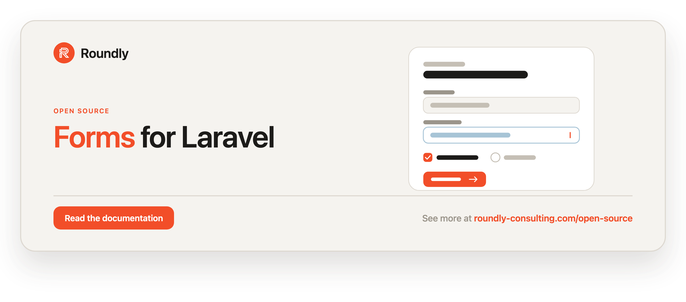

<!-- roundly-hero:start -->
<p align="center">
  <a href="https://roundly-consulting.com/open-source/docs/forms-for-laravel?utm_source=github&utm_medium=readme&utm_campaign=open-source&utm_content=forms-for-laravel">
    
  </a>
</p>
<!-- roundly-hero:end -->

<!-- roundly-badges:start -->
<p align="center">
  <a href="https://packagist.org/packages/roundly-consulting/forms-for-laravel"></a>
  <a href="https://github.com/roundly-consulting/forms-for-laravel/actions/workflows/run-tests.yml"></a>
  <a href="https://github.com/roundly-consulting/forms-for-laravel/actions/workflows/fix-php-code-style-issues.yml"></a>
  <a href="https://donate.stripe.com/dRmeVe8FX5PF1Qd9pXcEw00"></a>
  <a href="https://www.patreon.com/cw/roundly"></a>
  <a href="https://roundly-consulting.com/support-us?utm_source=github&utm_medium=readme&utm_campaign=open-source&utm_content=forms-for-laravel#crypto"></a>
</p>
<!-- roundly-badges:end -->

# Forms for Laravel

Define multi-step form structures (forms, groups, and fields) in your database, validate
user input against per-field rules, and store submissions — all driven by Eloquent models you
can swap for your own.

## Requirements

- PHP 8.4+
- Laravel 12 or 13

## Integrates with

Forms builds on other roundly-consulting packages (installed automatically as dependencies):

- **[enums-for-laravel](https://github.com/roundly-consulting/enums-for-laravel)** — `SubmissionStatus`
  gains `values()`/`options()`/`validationRule()`/`readable()` and case lookups for status filters and UIs.
- **[attributes-for-laravel](https://github.com/roundly-consulting/attributes-for-laravel)** — a typed
  value layer: each field's `type` maps to an `AttributeType`, so stored values read back as real PHP
  types (number → `int`, checkbox → `bool`, date → `CarbonImmutable`, multiselect → `array`) and are
  type-checked at validation time.
- **[media-library-for-laravel](https://github.com/roundly-consulting/media-library-for-laravel)** —
  `file`/`image` fields store their upload as media on the submission row (image variants, non-image
  passthrough, private signed streaming) instead of a bare disk path.
- **[approvals-for-laravel](https://github.com/roundly-consulting/approvals-for-laravel)** — a whole
  submission (the `FormSubmission` aggregate) can be routed through the approvals engine for
  sign-off by the reviewers you name, mirroring the decision back onto the submission status.

## Installation

```bash
composer require roundly-consulting/forms-for-laravel
```

Publish and run the migrations. The package's migrations are **not loaded automatically** —
publishing them is what puts them in your `database/migrations`, and a bare `php artisan
migrate` will not create the forms tables until you do:

```bash
php artisan vendor:publish --tag="forms-migrations"
php artisan migrate
```

They publish in dependency order (forms → groups → fields → submissions → form submissions),
so they run cleanly against an empty database and keep their foreign keys intact. This
package builds on other roundly packages, so publish and migrate theirs too
(`approvals-migrations`, `attributes-migrations`, `media-migrations`).

The migrations are forward-only: they define no `down()`, so `migrate:rollback` leaves the forms
tables in place.

Optionally publish the config file:

```bash
php artisan vendor:publish --tag="forms-config"
```

Optionally publish the translations to customise the package's messages:

```bash
php artisan vendor:publish --tag="forms-translations"
```

## Configuration

The published `config/forms.php` lets you swap the package models for your own and register
custom field resolvers:

```php
return [
    // Override any model with your own subclass.
    'models' => [
        'form' => \RoundlyConsulting\Forms\Models\Form::class,
        'group' => \RoundlyConsulting\Forms\Models\Group::class,
        'field' => \RoundlyConsulting\Forms\Models\Field::class,
        'submission' => \RoundlyConsulting\Forms\Models\Submission::class,
        'form_submission' => \RoundlyConsulting\Forms\Models\FormSubmission::class,
    ],

    // Key type of the polymorphic sender columns: 'bigint', 'uuid' or 'ulid'.
    'key_type' => env('FORMS_KEY_TYPE', 'bigint'),

    // Map a field `type` to the resolver that reads/writes its value.
    // `default` is used for any type without an explicit mapping.
    'fields' => [
        'default' => \RoundlyConsulting\Forms\Resolvers\DefaultResolver::class,
        'file' => \RoundlyConsulting\Forms\Resolvers\MediaFileResolver::class,
        'image' => \RoundlyConsulting\Forms\Resolvers\MediaFileResolver::class,
    ],

    // Map a field `type` to the attributes AttributeType used to cast stored
    // values and type-check submissions. Unlisted types (e.g. `time`) read back
    // exactly as stored.
    'field_types' => [
        'number' => 'integer',   // whole numbers; `decimal` / `float` map to 'float'
        'checkbox' => 'boolean',
        'date' => 'datetime',
        'multiselect' => 'array',
        // ...
    ],

    // Media settings for file/image fields (backed by media-library-for-laravel).
    'media' => [
        'bucket' => 'attachment',
        'visibility' => 'private',
        'disk' => env('FORMS_MEDIA_DISK'),
        'private_disk' => env('FORMS_MEDIA_PRIVATE_DISK', 'local'),
        'accepted_mime_types' => null,
        'max_file_size' => null,
        'responsive_widths' => null,
        'temporary_url_lifetime' => null,
    ],

    // Submission review via approvals-for-laravel. Disabled by default.
    'approvals' => [
        'enabled' => env('FORMS_APPROVALS_ENABLED', false),
    ],

    // Forms defined declaratively and synced to the DB with `php artisan forms:sync`.
    'definitions' => [],
];
```

| Key | Type | Default | Purpose |
|---|---|---|---|
| `models.form` | `class-string` | `Models\Form` | Model used for forms. |
| `models.group` | `class-string` | `Models\Group` | Model used for groups. |
| `models.field` | `class-string` | `Models\Field` | Model used for fields. |
| `models.submission` | `class-string` | `Models\Submission` | Model used for per-field submission rows. |
| `models.form_submission` | `class-string` | `Models\FormSubmission` | Aggregate model grouping a submission's rows (the approvals subject). |
| `key_type` | `string` | `bigint` (`FORMS_KEY_TYPE`) | Key type of the polymorphic `sender_id` columns — `bigint`, `uuid` or `ulid`. Set it to match your senders' primary keys before migrating; the sender key is stored and read back as-is (`AssembledSubmission::$senderId` is `int\|string\|null`). |
| `fields.default` | `class-string` | `Resolvers\DefaultResolver` | Resolver used for any field type without a specific mapping. |
| `fields.file` / `fields.image` | `class-string` | `Resolvers\MediaFileResolver` | Media-backed resolver; stores the upload as media on the submission row. |
| `field_types` | `array<string,string>` | see config | Maps a field `type` to an `AttributeType` for typed reads + validation. Shipped: `number`/`range` → `integer`, `float`/`decimal` → `float`, `checkbox`/`boolean`/`toggle` → `boolean`, `date`/`datetime` → `datetime`, `multiselect`/`checkboxes`/`tags` → `array`. `time` is left unmapped on purpose (a time of day reads back as stored). |
| `media.bucket` | `string` | `attachment` | Media bucket the submission row registers uploads into. |
| `media.visibility` | `string` | `private` | `private` (only ever linked via signed URLs) or `public`. |
| `media.disk` | `?string` | `null` (`FORMS_MEDIA_DISK`) | Disk every upload is stored on. `null` = by visibility: private → `media.private_disk`, public → media-library's default disk. |
| `media.private_disk` | `string` | `local` (`FORMS_MEDIA_PRIVATE_DISK`) | Non-public disk for private uploads and their variants when `media.disk` is `null`. |
| `media.accepted_mime_types` | `?array` | `null` | Restrict accepted mime types (null = open). |
| `media.max_file_size` | `?int` | `null` | Max upload size in bytes (null = media default). |
| `media.responsive_widths` | `?array` | `null` | Responsive image widths (null = media default ladder). |
| `media.temporary_url_lifetime` | `?int` | `null` | Signed URL lifetime in minutes (null = media default). |
| `approvals.enabled` | `bool` | `false` (`FORMS_APPROVALS_ENABLED`) | Enable routing submissions through the approvals engine. |
| `definitions` | `array` | `[]` | Declarative form definitions synced by `forms:sync`. |

## Usage

### Defining a form structure

A form has **groups** (think steps/sections), and each group has **fields**. Create them with
the models directly:

```php
use RoundlyConsulting\Forms\Models\Form;
use RoundlyConsulting\Forms\Models\Group;
use RoundlyConsulting\Forms\Models\Field;

$form = Form::create([
    'name' => 'My Form',
    'key' => 'my-form',
    'is_public' => true,        // optional, defaults to false
    'expires_at' => null,       // optional nullable datetime
]);

$group = Group::create([
    'form_id' => $form->getKey(),
    'name' => 'First Step',
    'key' => 'first-step',
    'order' => 0,
]);

$field = Field::create([
    'form_id' => $form->getKey(),
    'group_id' => $group->getKey(),
    'name' => 'Name',
    'key' => 'name',
    'help' => 'Enter your name',
    'type' => 'text',
    'validations' => ['required', 'string'],
    'options' => null,          // e.g. ['CZ' => 'Czechia', 'SK' => 'Slovakia']
    'autofill' => null,
    'order' => 0,
]);
```

Each field exposes a dotted `path()` built from `form.key`, `group.key`, and `field.key`
(e.g. `my-form.first-step.name`) — this is the request key the resolver reads from.

### Defining a form with the fluent builder

The `Forms` facade exposes a fluent builder that defines a whole form — groups and fields —
in one transactional call, auto-assigning each `order` by declaration sequence:

```php
use RoundlyConsulting\Forms\Facades\Forms;
use RoundlyConsulting\Forms\GroupBuilder;

$form = Forms::define('contact', 'Contact us')
    ->public()
    ->expiresAt(now()->addDays(30))
    ->group('details', 'Your details', function (GroupBuilder $g): void {
        $g->field('name', 'Name')->rules(['required', 'string'])->help('Full name');
        $g->field('email', 'Email')->type('email')->rules(['required', 'email']);
    })
    ->group('message', 'Message', function (GroupBuilder $g): void {
        $g->field('body', 'Message')->type('textarea')->rules(['required']);
    })
    ->create(); // returns the Form, persists the structure, dispatches FormCreated
```

Field builder methods: `type()`, `help()`, `autofill()`, `options()`, `rules()`, `order()`.
Override the auto-assigned order with `->order(n)` on a group or field — `->order(0)` included.

#### Typed field shortcuts

Thin sugar over `type()`/`rules()`/`options()` for the common field kinds:

```php
$g->field('email', 'Email')->email()->required();
$g->field('bio', 'Bio')->textarea();
$g->field('terms', 'Terms')->checkbox();      // type=checkbox, rule=boolean
$g->field('age', 'Age')->number();            // type=number, rule=numeric; whole numbers (3.5 fails)
$g->field('dob', 'DOB')->date();              // type=date, rule=date
$g->field('role', 'Role')->select(['a' => 'A', 'b' => 'B']);
$g->field('avatar', 'Avatar')->file();        // type=file (see MediaFileResolver under File uploads)
```

#### Conditional fields

Show or require a field only when another field of the same form — in any group — matches a
value. The condition is stored on the field and enforced during validation — a hidden field is
skipped (and whatever the request sent for it is not stored), and a conditionally-required field
is enforced only when its condition is met:

```php
Forms::define('signup', 'Sign up')
    ->group('step-1', 'Step 1', function (GroupBuilder $g): void {
        $g->field('country', 'Country');
        $g->field('age', 'Age')->number();
    })
    ->group('step-2', 'Step 2', function (GroupBuilder $g): void {
        $g->field('state', 'State')->requiredWhen('country', 'US');        // a field of step 1
        $g->field('guardian', 'Guardian')->visibleWhen('age', [16, 17], 'in');
        $g->field('zip', 'ZIP')->visibleWhen('step-1.country', 'US');      // named exactly
    })
    ->create();
```

A bare key is looked up in the dependent field's own group first, then in the form's other
groups (by group order); write `group_key.field_key` to name one exactly when two groups share
the key. Supported operators: `=` (default), `!=`, `in`, `not_in`, `filled`, `empty`.

#### Custom validation messages

Pass per-field messages as the second argument to `rules()` (or via `messages()`); they're
stored on the field and applied by the validator:

```php
$g->field('email', 'Email')->rules(['required', 'email'], [
    'required' => 'We really need your email.',
]);
```

### Working with forms via the `Forms` facade

The `Forms` facade resolves a form with its ordered groups and fields, validates request
input against each field's rules, and stores submissions:

```php
use RoundlyConsulting\Forms\Facades\Forms;

// Eager-loads groups and fields, ordered by their `order` column.
// Throws RoundlyConsulting\Forms\Exceptions\FormNotFoundException for an unknown key.
$form = Forms::find('contact');

// Validate request input — throws Illuminate\Validation\ValidationException on failure
// (a broken field rule and a value that fails its field's type alike). Returns the validated data.
$validated = Forms::validate(form: $form, request: request());

// Persist a submission for every field. Returns a SubmissionResult.
$result = Forms::submit(
    form: $form,
    request: request(),
    sender: auth()->user(), // any Eloquent model, or null
);

$result->uuid;        // shared reference id for this submission
$result->fieldCount;  // number of fields stored
$result->submittedAt; // CarbonInterface timestamp
```

| Method | Does |
|---|---|
| `find($key)` | a form with its ordered groups and fields |
| `define($key, $name)` → `->create()` | a fluent new form (`FormBuilder`) |
| `create(FormDefinitionData)` | a form from a definition |
| `update($key)` → `->save()` | a fluent structural edit (`UpdateFormBuilder`) |
| `sync(?array $definitions = null)` | create/update forms from `forms.definitions` |
| `validate($form, $request)` | validated data, or a `ValidationException` |
| `submit($form, $request, ?$sender, bypassClosed:)` | a final submission (`SubmissionResult`) |
| `draft($form, $request, ?$sender, ?$uuid, bypassClosed:)` | a resumable draft |
| `finalize($uuid, bypassClosed:)` | validate and promote a draft |
| `submissions($form)` | a `SubmissionQuery` reader (below) |
| `submission($uuid \| FormSubmission)` | a `SubmissionHandle`: `get()`, `model()`, `uuid()`, `finalize()`, `review()` |
| `review($uuid \| FormSubmission)` | a `PendingSubmissionReview` (see Submission review) |
| `createSubmission($field, $value, ?$sender, ?$uuid, bypassClosed:)` | one raw field row (imports, seeds), filed under its uuid's submission |
| `fake()` | swap in `FormsFake` (see Testing your application) |

#### Without the facade

The facade is sugar over `RoundlyConsulting\Forms\FormsManager` — inject it for the same API,
or call an action directly:

```php
use RoundlyConsulting\Forms\Actions\StoreSubmissionAction;
use RoundlyConsulting\Forms\FormsManager;

public function __construct(private FormsManager $forms) {}

$result = $this->forms->submit($this->forms->find('contact'), $request, $user);
$this->forms->submission($result->uuid)->get();

// The raw action
app(StoreSubmissionAction::class)->execute($form, $request, $user);
```

The host-facing actions are `FindFormAction`, `CreateFormAction`, `UpdateFormAction`,
`SyncFormsAction`, `ValidateSubmissionAction`, `StoreSubmissionAction`, `DraftSubmissionAction`,
`FinalizeSubmissionAction`, `FindSubmissionAction`, `ReviewSubmissionAction` and
`CreateSubmissionAction`.

#### Closed forms are rejected

Every path to a final submission rejects a form that isn't accepting them — a non-public form,
or one whose `expires_at` has passed — by throwing
`RoundlyConsulting\Forms\Exceptions\FormSubmissionClosedException`: `submit()`,
`draft()` (and `draftTo()`), `finalize()` — checked again at finalize time,
so a draft saved while the form was open can't be finalized after it closes — and the raw
`createSubmission()`. Pass `bypassClosed: true` for trusted internal/admin submissions:

```php
Forms::submit($form, request(), $user, bypassClosed: true);
Forms::draft($form, request(), $user, bypassClosed: true);
Forms::finalize($uuid, bypassClosed: true);
```

Three readable helpers back this: `$form->isExpired()`, `$form->isAcceptingSubmissions()`
(public **and** not expired) and `$form->ensureAcceptingSubmissions()` (throws when it isn't).
`$field->isRequired()` reports whether a field carries a plain `required` rule — a rule that
requires it only under a condition (`required_if`, `required_with`, …) does not count.

`createSubmission()` writes one row directly. Rows that share a `uuid` are filed under one
submission, created by the first of them, so `Forms::submission($uuid)` reads it and
`Forms::review($uuid)` reviews it like any other. A malformed uuid, or one that names another
form's submission or a draft, throws `SubmissionNotFoundException`:

```php
$first = Forms::createSubmission($nameField, ['value' => 'Ann'], $user, bypassClosed: true);
Forms::createSubmission($emailField, ['value' => 'ann@example.com'], $user, uuid: $first->uuid, bypassClosed: true);

Forms::submission($first->uuid)->get()->values; // ['name' => 'Ann', 'email' => 'ann@example.com']
```

### Draft submissions (save & resume)

Save a partial submission now and finalize it later. Drafts skip validation; finalizing runs
full validation before promoting the draft to a final submission:

```php
$draft = Forms::draft($form, request(), $user);   // returns SubmissionResult with a uuid
// ...later, resume by reusing the uuid (overwrites the prior draft values):
Forms::draft($form, request(), $user, uuid: $draft->uuid);
// finalize — validates, then marks the rows final and dispatches FormSubmitted:
Forms::finalize($draft->uuid);            // or Forms::submission($draft->uuid)->finalize()
```

Drafts are excluded from final-submission reads by default. Only a draft of the same form, saved
by the same sender, can be resumed: a finalized submission's uuid, another form's draft, another
sender's draft (an anonymous draft stays anonymous) or a malformed uuid throws
`DraftNotFoundException`, and the stored submission is left untouched. Resuming replaces the
draft's uploads (the old files are deleted).

Finalizing validates what the draft stored — uploads included, as the files they were, so `file`,
`mimes` and `max` rules apply — and keeps no value for a field its conditions now hide. Two
finalizes racing for one draft promote it once: the other throws `DraftNotFoundException` and
fires nothing.

### Reading submissions

`Forms::submissions($form)` returns a fluent reader that assembles the per-field rows back
into one keyed `[field_key => value]` set per submission, in form order (groups, then fields, by
`order`). A field key two groups of the form share is keyed `group_key.field_key` instead, so
neither answer overwrites the other (`['applicant.name' => 'Kid', 'guardian.name' => 'Parent']`).
Answers given to a field that was soft-deleted later are still read:

```php
$answers = Forms::submissions($form)
    ->forSender($user)   // optional
    ->latest()           // or ->oldest()
    ->get();             // Collection<AssembledSubmission>

$answers->first()->values;          // ['name' => 'Jane', 'email' => 'jane@example.com']
$answers->first()->value('name');   // 'Jane'
```

Drafts are excluded unless you call `->withDrafts()`. Narrow further with `->whereUuid($uuid)`
or by review outcome — `->pendingApproval()`, `->approved()`, `->rejected()`. The reader is always
scoped to its form: another form's uuid matches nothing.

One submission — or draft — by the uuid `submit()` / `draft()` returned:

```php
$submission = Forms::submission($result->uuid);

$submission->get();          // AssembledSubmission (a draft's values included)
$submission->model();        // the FormSubmission aggregate: status, sender, form
$submission->finalize();     // promote a draft
$submission->review();       // open a review (see below)
```

An unknown or malformed uuid throws `SubmissionNotFoundException`.

### Editing a form's structure

`Forms::update($key)` returns a builder that diffs your definition against the persisted
structure and saves the changes in a transaction — adding new groups/fields, renaming or
reordering existing ones, and firing the `FormUpdated` / `Group*` / `Field*` events only for
records that actually changed. Records absent from the definition are left untouched:

```php
Forms::update('contact')
    ->name('Contact us')
    ->public()
    ->group('details', 'Your details', function (GroupBuilder $g): void {
        $g->field('name', 'Full name')->rules(['required']);
        $g->field('phone', 'Phone'); // added
    })
    ->save();
```

### Typed field values

Each field `type` maps to an attributes `AttributeType` (see `forms.field_types`), so stored
values read back as real PHP types instead of raw strings, and submitted values are type-checked
during validation:

```php
Forms::submissions($form)->first()->values;
// ['age' => 42, 'subscribed' => true, 'born' => CarbonImmutable, 'tags' => ['a', 'b']]

// One per-field row (a `Submission`) reads its own value the same way:
$row = $form->fields->firstWhere('key', 'age')->submissions()->first();
$row->typedValue();                      // 42 (int); true (bool) for a `checkbox` row
```

A value that doesn't satisfy its field's type fails `Forms::validate()` (and finalize) with a
`ValidationException` under the field's path — `The Age field must be a valid integer.` — like any
other rule (a decimal in a `number()` field is one). A stored value that no longer converts (data
written before a type change, or straight through `createSubmission()`) reads back exactly as
stored instead of breaking the reader. Unlisted field types — `time` among them — keep the
free-form string behaviour.

### File uploads (media)

Map a field to the `file` or `image` type and the `MediaFileResolver` attaches the upload as
**media** on the submission row — image variants for images, passthrough for other files, served
back via signed/temporary URLs (private by default):

```php
$g->field('passport', 'Passport')->file();

// the submission row is the media owner:
$row = Forms::find('kyc')->fields->firstWhere('key', 'passport')->submissions->first();
$row->attachments();               // Collection<Media>
$row->attachmentUrl();             // first attachment's URL: signed if private, public if public
$row->attachmentTemporaryUrl();    // always a short-lived signed URL

// or through the resolver:
$resolver = Forms::find('kyc')->fields->firstWhere('key', 'passport')->resolver();
$resolver->fromStorage();          // the stored media UUID
$resolver->url();                  // same as attachmentUrl()
```

A private upload is only ever linked through a short-lived signed URL — never a public one.

Signed URLs protect the link, so the bytes must not be reachable any other way: with
`forms.media.disk` unset, private uploads (and their variants) are stored on
`forms.media.private_disk` — Laravel's `local` disk (`storage/app/private`) by default — never on
media-library's default `public` disk, which `php artisan storage:link` exposes under `/storage`.
Point `FORMS_MEDIA_PRIVATE_DISK` at another non-public disk (e.g. a private S3 disk) if you like;
if you set `FORMS_MEDIA_DISK` yourself, that disk is used for every upload, so keep it non-public
while uploads are private.

### Submission review (approvals)

Enable `forms.approvals.enabled` and route a whole submission — the `FormSubmission` aggregate —
through the approvals engine for sign-off by the reviewers you name. The decision is mirrored back
onto the submission status automatically. Reviewers are models using approvals-for-laravel's
`RoundlyConsulting\Approvals\Traits\GivesApprovals` trait:

```php
$submission = Forms::submission($result->uuid)->model();

Forms::review($submission)         // or Forms::review($uuid), Forms::submission($uuid)->review()
    ->requiring([$lead, $qa, $pm])
    ->quorum(2)                    // or ->unanimous(), ->any(), ->weighted($threshold)
    ->open();                      // submission status -> Pending

$lead->approve($submission);       // decisions flow into the open request
$qa->approve($submission);         // quorum met -> status Approved, SubmissionApproved fired

$submission->refresh();            // the status moved in the database: reload this instance
$submission->isApproved();         // true
$submission->isPendingApproval();  // false
```

Only the reviewers named in `requiring()` — or their delegates — can decide: anyone else,
the submitter included, gets approvals' `UnauthorizedApprovalException` and nothing is recorded.
`requiring()` is therefore mandatory; opening a review that names nobody throws
`SubmissionNotReviewableException`. A decided submission can be reviewed again (a new request,
back to Pending), and the same reviewers decide it afresh.

Approvals fire `SubmissionApproved` / `SubmissionRejected` / `SubmissionStatusChanged` — once per
outcome, even when two decisions race to resolve it. A rejection carries the rejecting actor.
With reviews disabled (the default), submissions keep the plain submit/finalize lifecycle.

### The HasForms trait

Add `RoundlyConsulting\Forms\Concerns\HasForms` to a user/sender model for a morph relation
and submit shortcuts:

```php
use RoundlyConsulting\Forms\Concerns\HasForms;

class User extends Authenticatable
{
    use HasForms;
}

$user->submitTo($form, request());     // Forms::submit with $user as sender
$user->draftTo($form, request());      // Forms::draft — both go through the manager, so Forms::fake() records them
$user->formSubmissions;                // morphMany of the user's per-field Submission rows (one per answered field)
Forms::submissions($form)->forSender($user)->get(); // the user's whole submissions, assembled
```

### Declarative forms (`forms:sync`)

Define forms in `config('forms.definitions')` and sync them into the database — creating
missing forms and updating changed ones, idempotently:

```php
// config/forms.php
'definitions' => [
    [
        'key' => 'contact',
        'name' => 'Contact',
        'is_public' => true,
        'groups' => [
            ['key' => 'details', 'name' => 'Details', 'fields' => [
                ['key' => 'name', 'name' => 'Name', 'rules' => ['required']],
            ]],
        ],
    ],
],
```

```bash
php artisan forms:sync
```

`Forms::sync($definitions)` runs the same logic with an explicit definition list. A definition's
`expires_at` may be a date string (`'2031-01-01 00:00:00'`), a Unix timestamp or a date object;
a group's or field's `order` defaults to its position, and an explicit `0` is kept.

### Reacting to events

After a submission, the package dispatches
`RoundlyConsulting\Forms\Events\FormSubmitted`:

```php
use RoundlyConsulting\Forms\Events\FormSubmitted;

class NotifyAdminsOfSubmission
{
    public function handle(FormSubmitted $event): void
    {
        // $event->form        — the submitted Form
        // $event->uuid        — the submission reference id (string)
        // $event->fieldCount  — number of fields stored (int)
    }
}
```

The structure also emits lifecycle events you can listen to: `FormCreated`, `FormUpdated`,
`FormDeleted`, and the equivalent `Group*` and `Field*` events (each carrying the model).

### Exceptions

Lookups throw package-specific exceptions, all extending
`RoundlyConsulting\Forms\Exceptions\FormsException`:

- `FormNotFoundException` — no form matches the key.
- `MultipleFormsFoundException` — more than one form matches the key.
- `UnresolvableFieldException` — no resolver is registered for a field's type.
- `FormSubmissionClosedException` — submit, draft, finalize or `createSubmission()` attempted on
  a non-public or expired form (without `bypassClosed: true`).
- `DraftNotFoundException` — `finalize()` called with an unknown draft uuid (or one a racing
  finalize already promoted), or `draft()` asked to resume a uuid that is not a draft of that
  form saved by that sender.
- `SubmissionNotFoundException` — `Forms::submission()` / `Forms::review()` given an unknown or
  malformed uuid, or `createSubmission()` given a uuid that is malformed or names another form's
  submission or a draft.
- `ReviewsDisabledException` — `Forms::review()` used while `forms.approvals.enabled` is false.
- `SubmissionNotReviewableException` — a review opened on a draft submission, or naming no
  reviewers.

A value that fails its field's type is a validation failure, not an exception of its own: it
throws Laravel's `ValidationException` (see Typed field values).

Messages are translatable via the `forms::messages` namespace.

### Query scopes & soft deletes

`Form` ships query scopes: `public()`, `active()` (no expiry or not yet expired),
`expired()`, and `forKey($key)`. `Group` and `Field` expose `ordered()`:

```php
use RoundlyConsulting\Forms\Models\Form;

$openForms = Form::query()->public()->active()->get();
```

All models use soft deletes — deleting a form keeps its rows and submissions in the
database (recoverable with `restore()` / queryable with `withTrashed()`). Deletes are not
cascaded, so soft-deleting a form leaves its groups, fields, and submissions intact, and past
submissions stay readable after a field, group or form they answered is soft-deleted.

A soft-deleted form, group or field gives its `key` up: a new form can take the key (a new group
or field theirs, within the same form or group), and `forms:sync` / `Forms::update()` re-create
it. Restoring a record takes the key back — and fails with a unique-constraint violation while a
live record holds it.

### Custom field resolvers

A resolver controls how a field's value is read from the request (`toStorable`) and read back
from storage (`fromStorage`). The package ships `DefaultResolver` and `MediaFileResolver` (see
**File uploads** above). A resolver that needs the persisted submission row before it can store
its value (like the media resolver) additionally implements
`RoundlyConsulting\Forms\Resolvers\AttachesToSubmission`, whose `attach()` runs after the row is
created, and whose `restoreUpload()` hands back a temporary copy of the stored file (or null) so
finalizing a draft can validate it against the field's rules. Implement
`RoundlyConsulting\Forms\Resolvers\Resolver` and map it to a field `type` in `config/forms.php`:

```php
use Illuminate\Database\Eloquent\Model;
use Illuminate\Http\Request;
use RoundlyConsulting\Forms\Models\Field;
use RoundlyConsulting\Forms\Resolvers\Resolver;

class CheckboxResolver implements Resolver
{
    public function __construct(private Field $field) {}

    public function toStorable(Request $request, ?Model $sender = null): array
    {
        return ['value' => $request->boolean($this->field->path())];
    }

    public function fromStorage(?Model $sender = null): mixed
    {
        return $this->field->submissions()
            ->where('field_id', $this->field->getKey())
            ->value('value')['value'] ?? null;
    }
}
```

```php
// config/forms.php
'fields' => [
    'default' => \RoundlyConsulting\Forms\Resolvers\DefaultResolver::class,
    'checkbox' => \App\Forms\CheckboxResolver::class,
],
```

### Autofill

Set a field's `autofill` to a class implementing `RoundlyConsulting\Forms\Autofill\Autofill`
to compute a default value on the fly:

```php
use RoundlyConsulting\Forms\Autofill\Autofill;
use RoundlyConsulting\Forms\Models\Field;

class CurrentUserEmail implements Autofill
{
    public function fill(Field $field): mixed
    {
        return auth()->user()?->email;
    }
}

// $field->getAutofillValue() resolves the class and returns its fill() result,
// or the raw `autofill` string when it isn't an Autofill class — such a class is never built.
```

### API resources

Ready-made `JsonResource`s render a form and its structure for API responses:

```php
use RoundlyConsulting\Forms\Facades\Forms;
use RoundlyConsulting\Forms\Resources\FormResource;

$form = Forms::find('my-form');

return FormResource::make($form);
```

`FormResource` nests `GroupResource` (when `groups` are loaded), which nests `FieldResource`
(when `fields` are loaded) — including each field's options, validations, and autofill state.

## Testing

```bash
composer test
```

### Testing your application

`Forms::fake()` swaps the manager for `FormsFake` — a recording `FormsManager` subtype, so
injected managers get it too. It still performs against the database, so the rows you'd expect
are really created (and a review still opens its approvals request) — the fake records every call
on top: through the facade, an injected manager, the builders, `Forms::submission()`, the `HasForms`
trait and `forms:sync`.

```php
use RoundlyConsulting\Approvals\Models\ApprovalRequest;
use RoundlyConsulting\Forms\Facades\Forms;
use RoundlyConsulting\Forms\Models\FormSubmission;

$fake = Forms::fake();

// ... exercise your application code that submits the form ...

$fake->assertSubmitted($form);
$fake->assertSubmitted($form, fn ($result, $form) => $result->fieldCount === 3);
$fake->assertSubmittedCount(1);
$fake->assertNotSubmitted($otherForm);
$fake->assertReviewOpened(fn (ApprovalRequest $request, FormSubmission $submission) => $request->quorum === 2);
```

| Records | Assert | Assert none |
|---|---|---|
| `submit()`, `$user->submitTo()` | `assertSubmitted(?Form, ?callable(SubmissionResult, Form))`, `assertSubmittedCount(int)`, `assertNotSubmitted(?Form)` | `assertNothingSubmitted()` |
| `draft()`, `$user->draftTo()` | `assertDrafted(?Form, ?callable)` | `assertNothingDrafted()` |
| `finalize()`, `submission()->finalize()` | `assertFinalized(?string $uuid)` | `assertNothingFinalized()` |
| `define()` | `assertFormDefined(string $key)` | `assertNoFormDefined()` |
| `create()`, `define()->create()` | `assertFormCreated(?callable(Form))` | `assertNoFormCreated()` |
| `update()->save()` | `assertFormUpdated(string $key)` | `assertNoFormUpdated()` |
| `createSubmission()` | `assertSubmissionCreated(?callable(Submission))` | `assertNoSubmissionCreated()` |
| `sync()`, `forms:sync` | `assertSynced()` | `assertNothingSynced()` |
| `review()->…->open()` | `assertReviewOpened(?callable(ApprovalRequest, FormSubmission))` | `assertNothingReviewed()` |

The `InteractsWithForms` trait adds ergonomic helpers to your test case
(`fakeForms()`, `submitForm($form, $values, $sender)`, `draftForm(...)`). Values are nested per
group or flat by `group_key.field_key` (one style per group):

```php
uses(RoundlyConsulting\Forms\Testing\InteractsWithForms::class);

$fake = $this->fakeForms();
$this->submitForm($form, ['details' => ['name' => 'Ann']]);
$this->submitForm($form, ['details.name' => 'Ann']);   // the same submission, flat
$fake->assertSubmitted($form);
```

Opt into the Pest expectation matchers from your `tests/Pest.php`:

```php
RoundlyConsulting\Forms\Testing\FormExpectations::register();

expect($form)->toBeAcceptingSubmissions();
expect($expiredForm)->toBeExpired();
```

## Changelog

Please see [CHANGELOG](CHANGELOG.md) for what has changed recently.

<!-- roundly-support:start -->
## Support our work

This package is free and open source, built and maintained by
[Roundly Consulting](https://roundly-consulting.com/open-source?utm_source=github&utm_medium=readme&utm_campaign=open-source&utm_content=forms-for-laravel).
If it saves you time, please consider supporting our open-source work — a one-time donation, a
monthly pledge on Patreon or a crypto donation helps fund maintenance, new features and new
packages.

<a href="https://donate.stripe.com/dRmeVe8FX5PF1Qd9pXcEw00"></a>
<a href="https://www.patreon.com/cw/roundly"></a>
<a href="https://roundly-consulting.com/support-us?utm_source=github&utm_medium=readme&utm_campaign=open-source&utm_content=forms-for-laravel#crypto"></a>
<!-- roundly-support:end -->

## License

The MIT License (MIT). Please see [LICENSE](LICENSE.md) for more information.
